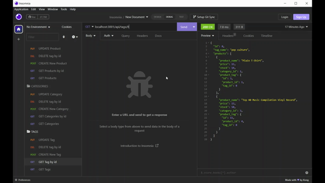

# 13 Object-Relational Mapping (ORM): E-Commerce Back End

## Description

My challenge is to build the back end for an e-commerce site. Using Express.js API and configure it to use Sequelize to interact with a MySQL database. I was already given a starter code with instructions where to code and create a connection. Using dotenv to keep hidden MySQL username and password for account protection purposes. This challenge helps me understand sequelize syntax and the use of routing methods.

## User Story

```md
AS A manager at an internet retail company
I WANT a back end for my e-commerce website that uses the latest technologies
SO THAT my company can compete with other e-commerce companies
```

## Acceptance Criteria

```md
GIVEN a functional Express.js API
WHEN I add my database name, MySQL username, and MySQL password to an environment variable file
THEN I am able to connect to a database using Sequelize
WHEN I enter schema and seed commands
THEN a development database is created and is seeded with test data
WHEN I enter the command to invoke the application
THEN my server is started and the Sequelize models are synced to the MySQL database
WHEN I open API GET routes in Insomnia for categories, products, or tags
THEN the data for each of these routes is displayed in a formatted JSON
WHEN I test API POST, PUT, and DELETE routes in Insomnia
THEN I am able to successfully create, update, and delete data in my database
```

## Installations of NPM (Node Package Manager)
These are the packages required to run the application.

 - Express
 - Mysql2
 - Sequelize

 1. Open in Integrated Terminal
 2. "npm install --y"
 3. "mysql -u root -p"
 4. "source db/schema.sql"
 5. "use ecommerce_db;" then "quit;" mysql
 6. "npm run seed"
 7. "node server.js"

 ## Walkthrough Videos

 GET routes to return all categories, all products, and all tags being tested in Insomnia Core:

 

 Full Video: https://drive.google.com/file/d/1os2_hcl90jjHr7XO76FTT6LUD7SdYvgX/view


 GET routes to return a single category, a single product, and a single tag being tested in Insomnia Core:

 

 Full Video: https://drive.google.com/file/d/1lhatJZZJT6XQN0ABLMaqQduXDMfF8u93/view


 Shows the POST, PUT, and DELETE routes for categories, products, and tags being tested in Insomnia Core:

 

 Full Video: https://drive.google.com/file/d/1MUjToQAMGylJuSSMSWjmHZ1eeE-sZQFB/view

 ## Credits

 Tiger Nguyen (Me)